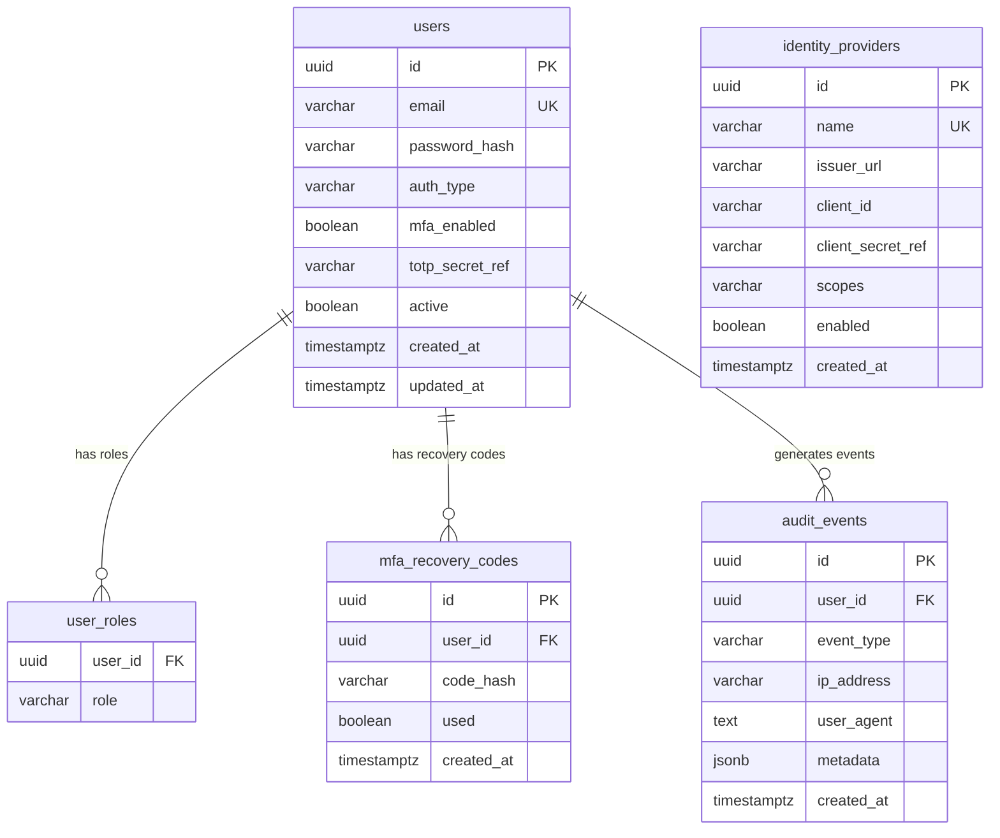

# PR-02: Flyway Schema, JPA Entities, and Repositories

## What this PR does

Establishes the persistent data model for the auth server. Every table that the auth server will ever own is defined here (except `oauth2_registered_client`, which is added in PR-05). JPA entities and Spring Data repositories are layered on top so the rest of the application can read and write through a type-safe API.

---

## Database schema



### Design notes

- **`auth_type`** (`LOCAL` | `FEDERATED`) — a local user has a `password_hash`; a federated user was provisioned via an upstream OIDC/SAML provider (PR-07) and has no password hash.
- **`totp_secret_ref`** — stores an AWS Secrets Manager ARN, not the actual TOTP secret. The secret itself never lives in the database (enforced from day one).
- **`client_secret_ref`** on `identity_providers` — same pattern: ARN only, plaintext secret never stored.
- **`metadata` (JSONB)** — audit events carry a flexible payload (e.g. `{"reason": "invalid_password", "attempts": 3}`). Using JSONB lets queries filter on nested fields without a schema change.

---

## Flyway migrations

| File | Description |
|------|-------------|
| `V1__create_users.sql` | `users` table |
| `V2__create_user_roles.sql` | `user_roles` join table |
| `V3__create_identity_providers.sql` | `identity_providers` table |
| `V4__create_mfa_recovery_codes.sql` | `mfa_recovery_codes` table |
| `V5__create_audit_events.sql` | `audit_events` table |
| `V6__create_indexes.sql` | Indexes on email, audit event columns |
| `V7__seed_admin_user.sql` | Seed `admin@localhost` / `changeme` (BCrypt 10 rounds) |

The seed admin password is hardcoded only for local development. The comment in V7 instructs operators to change it immediately after first login.

---

## JPA entities

| Class | Table(s) | Notes |
|-------|---------|-------|
| `User` | `users` + `user_roles` | Implements `UserDetails`; roles stored as `@ElementCollection` |
| `IdentityProvider` | `identity_providers` | Immutable config — no `updated_at` |
| `MfaRecoveryCode` | `mfa_recovery_codes` | Marked used, never deleted (audit trail) |
| `AuditEvent` | `audit_events` | Append-only; `metadata` mapped with `@JdbcTypeCode(SqlTypes.JSON)` |

The `@JdbcTypeCode(SqlTypes.JSON)` annotation on `AuditEvent.metadata` is required for Hibernate 6 to correctly bind a `Map<String,Object>` to a PostgreSQL `jsonb` column. Without it, Hibernate tries to bind a `varchar`, causing a type mismatch.

---

## Repositories

| Interface | Key methods |
|-----------|------------|
| `UserRepository` | `findByEmail`, `existsByEmail` |
| `IdentityProviderRepository` | `findByEnabledTrue` |
| `MfaRecoveryCodeRepository` | `findByUserIdAndUsedFalse` |
| `AuditEventRepository` | `findByUserId`, `findByEventType` |

---

## Test strategy

Repository tests use **Testcontainers** with `@ServiceConnection`:

```java
@Container
@ServiceConnection
static PostgreSQLContainer<?> postgres = new PostgreSQLContainer<>("postgres:15-alpine");
```

Flyway migrations run against the real PostgreSQL container before each test class. This catches PostgreSQL-specific issues (type mismatches, constraint violations) that an H2 in-memory database would silently accept.

The `test` profile disables Flyway and uses H2. Tests that need real schema use Testcontainers directly (no profile needed — `@ServiceConnection` overrides the DataSource).
