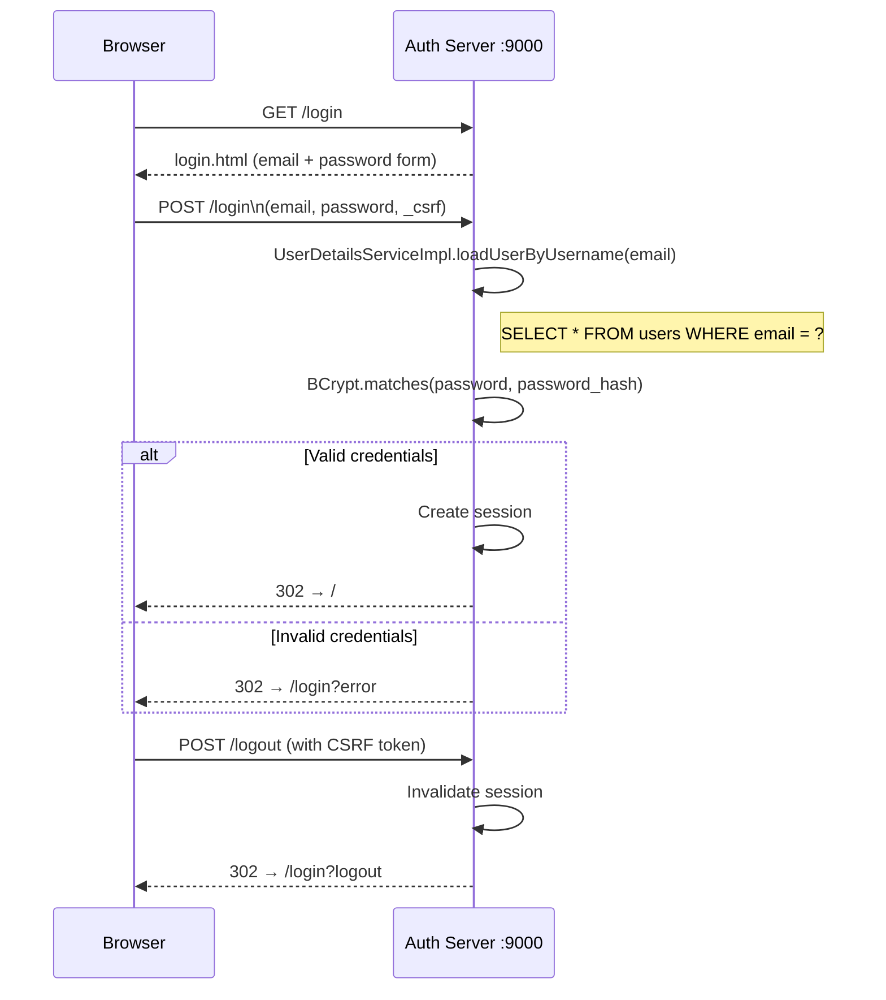

# PR-03: Local Form Login

## What this PR does

Wires Spring Security form login so that users stored in the `users` table can authenticate with their email and BCrypt password. This is the first time the auth server's own login UI is live and testable in a browser.

---

## Added / changed

| Artifact | Role |
|----------|------|
| `SecurityConfig` (`@Order(2)`) | Default Spring Security filter chain — form login, logout, public path rules |
| `UserDetailsServiceImpl` | Loads a `User` entity by email, wraps it in Spring Security's `UserDetails` |
| `PasswordEncoder` bean (`BCryptPasswordEncoder`) | Used to verify passwords at login; also used by PR-04 to hash client secrets |
| `LoginController` (view) | Serves `GET /login` → `login.html` |
| `login.html` | Thymeleaf template — email + password form |
| `pom.xml` | Added `spring-boot-starter-security`, `thymeleaf-extras-springsecurity6`, `spring-security-test` |

---

## Login flow



---

## Security rules (`@Order(2)` filter chain)

| Path pattern | Access |
|-------------|--------|
| `/actuator/health`, `/actuator/info` | Public |
| `/login`, `/error` | Public |
| `/css/**`, `/js/**`, `/images/**`, `/webjars/**` | Public |
| Everything else | Requires authentication |

### Why `@Order(2)`?

This filter chain is given order 2 so that the Spring Authorization Server filter chain (added in PR-04 at `@Order(1)`) takes precedence for all OAuth2/OIDC endpoints. If both chains had the same order, Spring would throw an ambiguity error.

---

## `UserDetailsServiceImpl`

```
email → UserRepository.findByEmail(email)
      → User (JPA entity, implements UserDetails)
      → Spring Security authenticates with BCryptPasswordEncoder.matches()
```

The `User` entity implements `UserDetails` directly, so the service just wraps the JPA lookup — no mapping step required.

---

## Seed credentials (local dev)

| Field | Value |
|-------|-------|
| Email | `admin@localhost` |
| Password | `changeme` |
| Source | Flyway V7 seed migration |

Change this password immediately after first login in any non-local environment.
