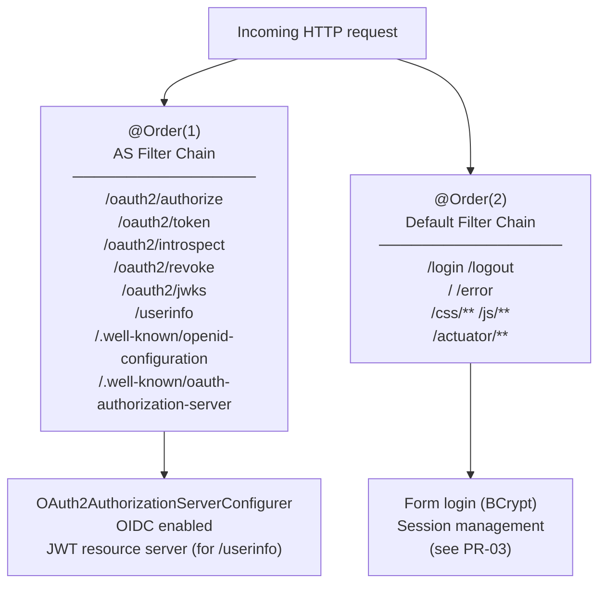
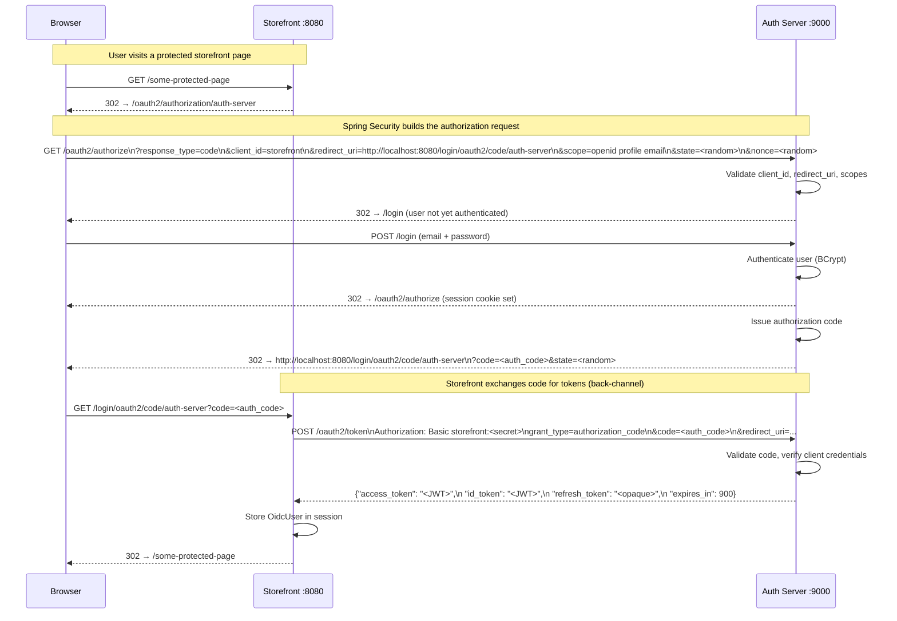

# Phase-04: Spring Authorization Server — OIDC Token Issuance

## What this PR does

Transforms the auth server from a simple form-login app into a full OIDC provider by wiring in `spring-boot-starter-oauth2-authorization-server`. After this PR, the auth server can issue authorization codes, access tokens (signed JWTs), refresh tokens, and ID tokens to registered OAuth2 clients (e.g. the storefront).

---

## Two-filter-chain architecture

Spring Security allows multiple `SecurityFilterChain` beans, selected by order. The auth server uses two:



The AS chain uses `applyDefaultSecurity(http)` which calls `http.securityMatcher(endpointsMatcher)` — restricting it to only the AS endpoints. Everything else falls through to the default chain.

---

## OIDC authorization code flow



---

## Key beans (`AuthorizationServerConfig`)

| Bean | Purpose |
|------|---------|
| `authorizationServerSecurityFilterChain` | AS filter chain at `@Order(1)` |
| `registeredClientRepository` | Client registry — in-memory in this PR, JDBC in PR-05 |
| `jwkSource` | RSA-2048 key pair used to sign all JWTs |
| `jwtDecoder` | Validates JWTs presented to `/userinfo` (resource-server role) |
| `authorizationServerSettings` | Sets the issuer URI from `${auth.server.base-url}` |

---

## Storefront client (in-memory, replaced by DB in PR-05)

| Setting | Value |
|---------|-------|
| `client_id` | `storefront` |
| `client_secret` | BCrypt(`secret`) — via injected `PasswordEncoder` |
| `grant_types` | `authorization_code`, `refresh_token` |
| `redirect_uri` | `http://localhost:8080/login/oauth2/code/auth-server` |
| `redirect_uri` (alt) | `http://127.0.0.1:8080/login/oauth2/code/auth-server` |
| `post_logout_redirect_uri` | `http://localhost:8080/` |
| `scopes` | `openid`, `profile`, `email` |
| `access_token_ttl` | 15 minutes |
| `refresh_token_ttl` | 8 hours |
| `reuse_refresh_tokens` | `false` — new refresh token on every use |
| `require_consent` | `false` |

### Why BCrypt via `PasswordEncoder` injection, not `{noop}`?

Spring Authorization Server uses whatever `PasswordEncoder` bean is registered to verify client secrets. PR-03 registered `BCryptPasswordEncoder`. Using `{noop}secret` would bypass BCrypt and always fail verification, breaking the token endpoint. Injecting `PasswordEncoder` into `registeredClientRepository` ensures the stored hash is always BCrypt-encoded at the right strength.

---

## OIDC discovery and JWKS

Spring Authorization Server auto-exposes:

| Endpoint | Purpose |
|----------|---------|
| `GET /.well-known/openid-configuration` | OIDC discovery document — lists all supported endpoints, scopes, algorithms |
| `GET /oauth2/jwks` | Public RSA key set — clients use this to verify JWTs without contacting the auth server |
| `GET /userinfo` | Returns OIDC claims for the authenticated user (requires a valid access token) |

The private RSA key component (`d`) is never exposed via JWKS — verified in `OidcDiscoveryTest.jwksEndpoint_returnsRsaPublicKey`.

---

## Exception handling: browser vs. API

A `MediaTypeRequestMatcher` alone is insufficient for distinguishing browser requests from API calls: an absent `Accept` header defaults to `*/*` which includes `text/html`, causing the token endpoint to return a `302` (login redirect) instead of `401 Unauthorized`.

The fix uses explicit `AntPathRequestMatcher` entries placed **before** the `TEXT_HTML` matcher:

```
/oauth2/token, /oauth2/introspect, /oauth2/revoke  →  401 Unauthorized  (HttpStatusEntryPoint)
Accept: text/html requests                          →  302 → /login       (LoginUrlAuthenticationEntryPoint)
```

---

## Signing key

The RSA-2048 key pair is generated in-memory at startup. This is intentional for local development — keys rotate on every restart, which is safe because all issued tokens expire within 15 minutes / 8 hours.

For production (PR-14), the key will be loaded from AWS Secrets Manager so it survives restarts and allows token validation across rolling deploys. The `application-prod.properties` already has the placeholder property commented in: `auth.signing-key-ref=${AUTH_SERVER_SIGNING_KEY_REF}`.
