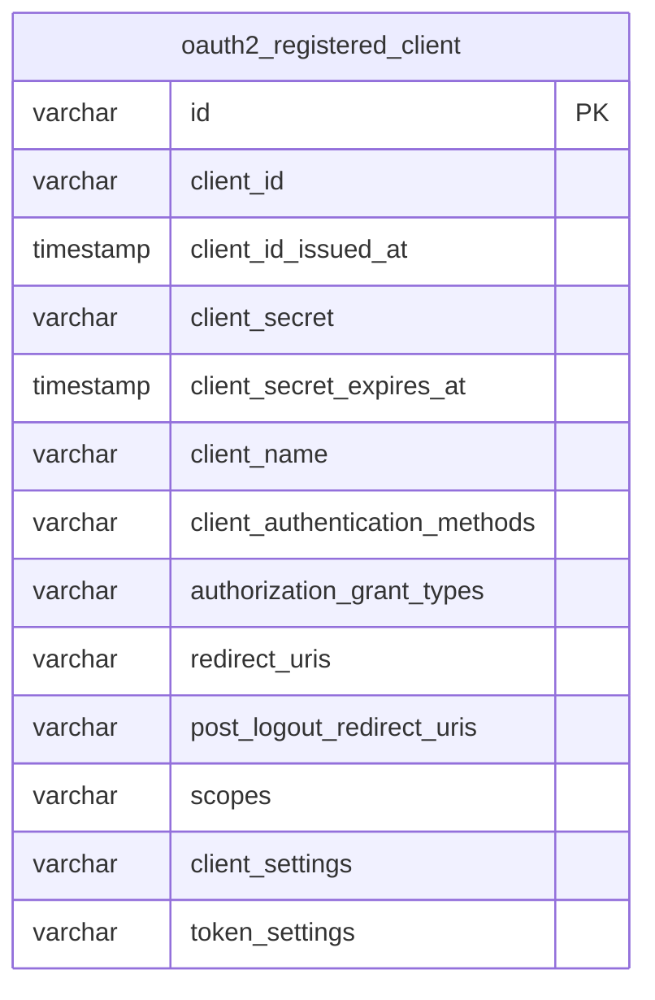

# Phase-05: Database-Backed Client Registry

## What this PR does

Replaces `InMemoryRegisteredClientRepository` with `JdbcRegisteredClientRepository` backed by a new `oauth2_registered_client` table. Registered OAuth2 clients now persist across restarts and can be managed without a code change or redeployment.

---

## What changed

| Before | After |
|--------|-------|
| `InMemoryRegisteredClientRepository` — lost on restart | `JdbcRegisteredClientRepository` — persisted in PostgreSQL |
| Client definition hardcoded in `AuthorizationServerConfig` | Client definition lives in `ClientDataLoader` (seeded once at startup) |
| `registeredClientRepository(PasswordEncoder)` bean | `registeredClientRepository(JdbcTemplate)` bean |

---

## New table: `oauth2_registered_client`

Flyway V8 creates this table using Spring Authorization Server's standard schema.



`client_settings` and `token_settings` are JSON strings serialized by Spring AS's own Jackson mapper. They contain type discriminator hints like `"@class":"java.util.Collections$UnmodifiableMap"`, so they must be written by `JdbcRegisteredClientRepository.save()` — not manually in SQL.

---

## Component overview

```mermaid
graph LR
    Config["AuthorizationServerConfig\n.registeredClientRepository(JdbcTemplate)"]
    Loader["ClientDataLoader\n@Profile(!prod)\nApplicationRunner"]
    Repo["JdbcRegisteredClientRepository"]
    DB[("PostgreSQL\noauth2_registered_client")]
    AS["Spring Authorization Server\n(OAuth2 flows)"]

    Config -->|creates| Repo
    Repo <-->|reads / writes| DB
    Loader -->|seeds storefront on startup\n(idempotent)| Repo
    AS -->|client lookup on every OAuth2 request| Repo
```

---

## `ClientDataLoader` — why not a Flyway seed migration?

The `client_settings` and `token_settings` columns store JSON with Spring AS–specific class discriminators. Hardcoding that JSON in a V9 migration would couple the migration file to a specific version of Spring AS's serialization format. If Spring AS ever changes the format, the migration would produce a corrupt row.

`ClientDataLoader.save()` delegates serialization entirely to Spring AS, so the stored format is always correct regardless of library version.

### Profile behaviour

| Profile active | `ClientDataLoader` runs? | Result |
|---------------|--------------------------|--------|
| `local`, `test`, `dev` | Yes | `storefront` client seeded on first startup |
| `prod` | **No** | Clients managed via admin UI (PR-11) or direct DB insert |

The check is idempotent: `findByClientId("storefront") != null → return` prevents duplicate inserts on subsequent restarts.

---

## H2 test compatibility

The Flyway migrations V1–V8 use PostgreSQL-specific syntax (`gen_random_uuid()`, `TIMESTAMP WITH TIME ZONE`). Flyway is disabled in the `test` profile. To make the OIDC tests pass without Testcontainers, `src/test/resources/schema.sql` provides an H2-compatible DDL for `oauth2_registered_client`:

```
Application starts (test profile)
  → H2 DataSource initialises
  → Spring Boot auto-runs src/test/resources/schema.sql  ← creates oauth2_registered_client in H2
  → JPA context initialises (ddl-auto=none)
  → ApplicationRunner.run() called
  → ClientDataLoader.run() → inserts storefront client into H2
  → Tests execute with a populated registry
```

Spring Boot runs `schema.sql` automatically for embedded databases (`spring.sql.init.mode=embedded` default) regardless of Flyway's state.

---

## Flyway migration history after PR-05

| Version | Description |
|---------|-------------|
| V1–V6 | User/role/IDP/MFA/audit schema + indexes (PR-02) |
| V7 | Seed admin user (PR-02) |
| V8 | `oauth2_registered_client` table (this PR) |
