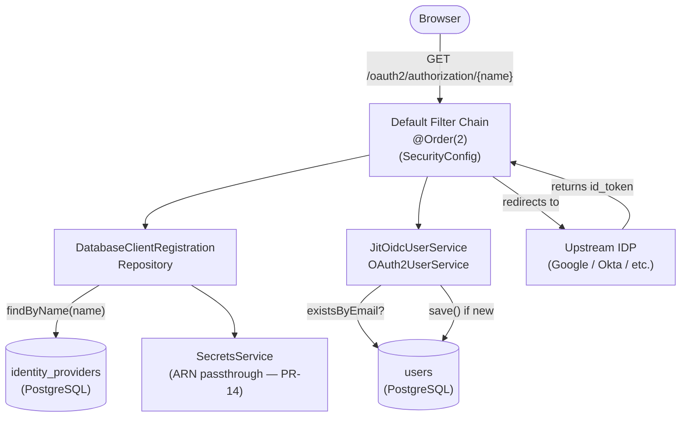
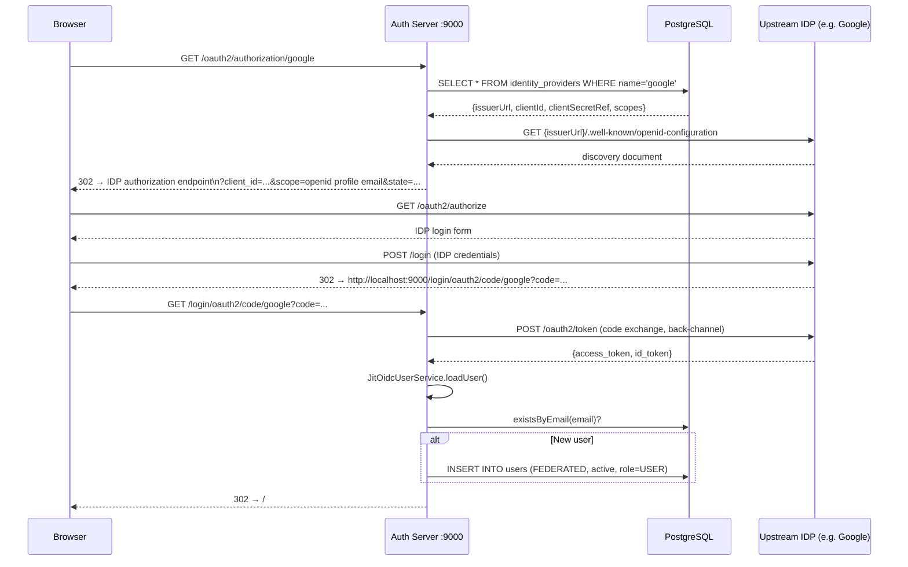

# Phase-07: Upstream IDP Federation — DatabaseClientRegistrationRepository + JIT Provisioning

## What this PR does

Enables the auth server to act as an OAuth2 client to upstream OIDC identity providers (e.g. Google, Okta, Entra ID). When a user authenticates via an upstream IDP, they are automatically provisioned as a `FEDERATED` user in the local `users` table on first login. Subsequent logins skip provisioning (idempotent). IDP configuration is stored in the existing `identity_providers` table (introduced in PR-02).

---

## What changed

| Before | After |
|--------|-------|
| Auth server is an OIDC provider only | Auth server is both provider and client |
| No upstream IDP support | `DatabaseClientRegistrationRepository` reads IDPs from DB |
| User can only authenticate locally (BCrypt) | FEDERATED users authenticate through upstream OIDC |
| `SecurityConfig` — form login only | `SecurityConfig` — form login + `oauth2Login` |
| No `spring-boot-starter-oauth2-client` | Dependency added |

---

## New components



### `DatabaseClientRegistrationRepository`

Implements `ClientRegistrationRepository`. On `findByRegistrationId(name)`:
1. Looks up the `identity_providers` row with `name = registrationId` and `enabled = true`
2. Resolves the `client_secret_ref` via `SecretsService`
3. Calls `ClientRegistrations.fromIssuerLocation(issuerUrl)` to perform OIDC discovery and build the full `ClientRegistration`
4. Caches the result in a `ConcurrentHashMap` — avoids repeated HTTP discovery calls per request

### `JitOidcUserService`

Wraps Spring's `OidcUserService`. After the upstream OIDC flow completes:
- Calls `UserRepository.existsByEmail(email)` — if the user doesn't exist, `provision(email)` is called
- `provision()` creates a `User` with `authType = FEDERATED`, `active = true`, `roles = ["USER"]`, and no `passwordHash`
- `provision()` is package-private for unit testability without a full OIDC mock

### `SecretsService`

Single-method helper: `resolve(ref)`. Returns `ref` as-is for dev/test (plain secret stored in `client_secret_ref`). Throws `UnsupportedOperationException` for ARN-format refs — AWS Secrets Manager integration is wired in PR-14.

---

## End-to-end federated login flow



---

## Security model: LOCAL vs FEDERATED users

| Property | LOCAL | FEDERATED |
|----------|-------|-----------|
| `auth_type` | `LOCAL` | `FEDERATED` |
| `password_hash` | BCrypt hash | `null` |
| `credentials_non_expired` | `true` | `false` (intentional — blocks form login) |
| Authentication path | Form login (`/login`) | Upstream IDP (`/oauth2/authorization/{name}`) |

`UserDetailsServiceImpl` sets `credentialsNonExpired = false` for FEDERATED users. This means if a federated user somehow ends up on the form-login path (e.g. via direct POST), Spring Security will reject them with `CredentialsExpiredException` — they must go through their IDP.

---

## `SecretsService` — ARN lifecycle

```
PR-07 (now)         client_secret_ref = "plain-secret-value"  → returned as-is
PR-14 (production)  client_secret_ref = "arn:aws:secretsmanager:..."  → resolved via AWS SDK
```

Storing an ARN instead of a plain secret in `client_secret_ref` is enforced by convention from PR-02 (schema design). The `SecretsService` guards against accidental ARN usage before PR-14 is in place by throwing `UnsupportedOperationException`.

---

## H2 test compatibility

`identity_providers` table is created by `src/test/resources/schema.sql` (same file that handles `oauth2_registered_client`). The `JitOidcUserServiceTest` is a pure Mockito unit test — no application context required.

---

## Flyway migration history after PR-07

| Version | Description |
|---------|-------------|
| V1–V6 | User/role/IDP/MFA/audit schema + indexes (PR-02) |
| V7 | Seed admin user (PR-02) |
| V8 | `oauth2_registered_client` table (PR-05) |

No new migration — `identity_providers` was created in PR-02. IDP rows are inserted manually (dev) or via the admin UI (PR-11).
