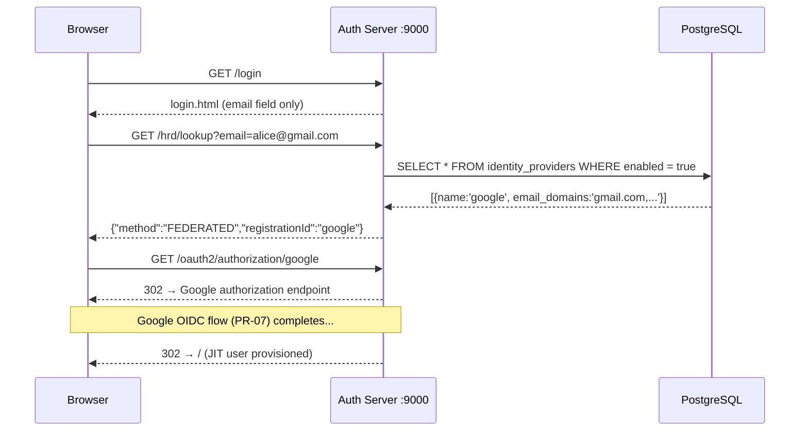
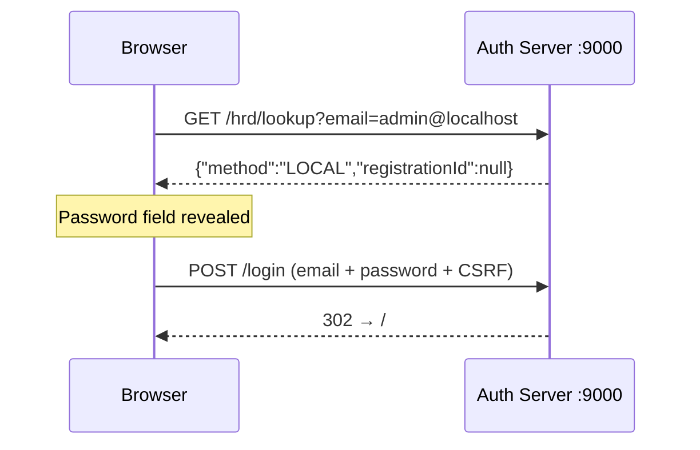

# Phase-08: HRD Email-First Login UI + Google OIDC End-to-End

## What this PR does

Replaces the single-page email+password form with a two-step **Home Realm Discovery (HRD)** login flow. On step one the user enters their email; a lightweight API call determines whether that email's domain belongs to a configured upstream IDP. If it does, the browser is redirected straight to the upstream provider (e.g. Google). If not, the password field is revealed for local BCrypt authentication.

A `GET /hrd/lookup` endpoint powers the decision. IDP domain affinity is stored in a new `email_domains` column on `identity_providers`.

---

## What changed

| Before | After |
|--------|-------|
| Single-page email + password form | Two-step: email → domain check → password or IDP redirect |
| No domain-based routing | `identity_providers.email_domains` drives IDP selection |
| `GET /hrd/lookup` did not exist | Public endpoint returns `{method, registrationId}` |
| Login page shows password immediately | Password only revealed after LOCAL determination |

---

## HRD flow





---

## New components

### `V9__add_email_domains_to_identity_providers.sql`

```sql
ALTER TABLE identity_providers
    ADD COLUMN email_domains VARCHAR(500);
```

Nullable — IDPs without `email_domains` are valid for federated login (reachable via `/oauth2/authorization/{name}`) but are not domain-routed from the HRD endpoint.

### `HrdService`

Loads all enabled IDPs, splits `email_domains` on commas, and checks the email's domain (case-insensitive). Returns `HrdResult("LOCAL", null)` or `HrdResult("FEDERATED", idpName)`.

Domain matching is done in Java rather than SQL to avoid unreliable substring LIKE matches (`LIKE '%gmail.com%'` would match `notgmail.com`).

### `HrdController`

`GET /hrd/lookup?email=…` — public endpoint (no authentication required). Returns:

```json
// Federated domain
{ "method": "FEDERATED", "registrationId": "google" }

// Local or unknown domain
{ "method": "LOCAL", "registrationId": null }
```

Using GET keeps the request idempotent and CSRF-free — the lookup is read-only.

### `login.html` (two-step UI)

```
Step 1                         Step 2 (LOCAL)
┌─────────────────────┐        ┌─────────────────────┐
│ Email address       │   →    │ alice@example.com  ↩ │
│ [________________]  │        │ Password            │
│ [   Continue     ]  │        │ [________________]  │
└─────────────────────┘        │ [    Sign in     ]  │
                                └─────────────────────┘

Step 2 (FEDERATED): window.location → /oauth2/authorization/google
```

On network error during the lookup, the UI falls back to showing the password step (local login still works).

---

## Google OIDC setup (local dev)

1. Go to [console.cloud.google.com](https://console.cloud.google.com) → APIs & Services → Credentials → **Create OAuth 2.0 Client ID** (Web application)
2. Add authorized redirect URI: `http://localhost:9000/login/oauth2/code/google`
3. Seed the IDP row in local PostgreSQL:

```sql
INSERT INTO identity_providers
    (name, issuer_url, client_id, client_secret_ref, scopes, email_domains, enabled)
VALUES (
    'google',
    'https://accounts.google.com',
    '<YOUR_GOOGLE_CLIENT_ID>',
    '<YOUR_GOOGLE_CLIENT_SECRET>',
    'openid,profile,email',
    'gmail.com,googlemail.com',
    true
);
```

4. Start auth server: `mvn spring-boot:run -Dspring-boot.run.profiles=local`
5. Visit `http://localhost:9000/login`, enter a `@gmail.com` address — the flow routes to Google automatically.

On first successful Google login, `JitOidcUserService` (PR-07) provisions a `FEDERATED` user in the `users` table.

---

## Security notes

### Domain routing vs. email enumeration

The HRD endpoint reveals only whether a domain is federated — not whether a specific email account exists. This is consistent with industry practice (Google, Okta, Entra all behave this way). An attacker learns "gmail.com uses Google login" but not "alice@gmail.com has an account here."

### CSRF

`GET /hrd/lookup` is idempotent and carries no session side effects, so CSRF protection is not applicable. Spring Security's CSRF filter only applies to state-changing methods (POST/PUT/DELETE).

---

## Flyway migration history after PR-08

| Version | Description |
|---------|-------------|
| V1–V6 | User/role/IDP/MFA/audit schema + indexes (PR-02) |
| V7 | Seed admin user (PR-02) |
| V8 | `oauth2_registered_client` table (PR-05) |
| V9 | `email_domains` column on `identity_providers` (this PR) |
