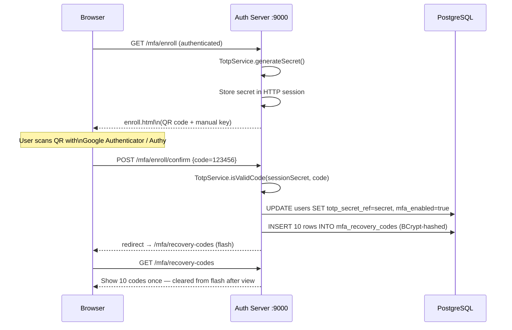
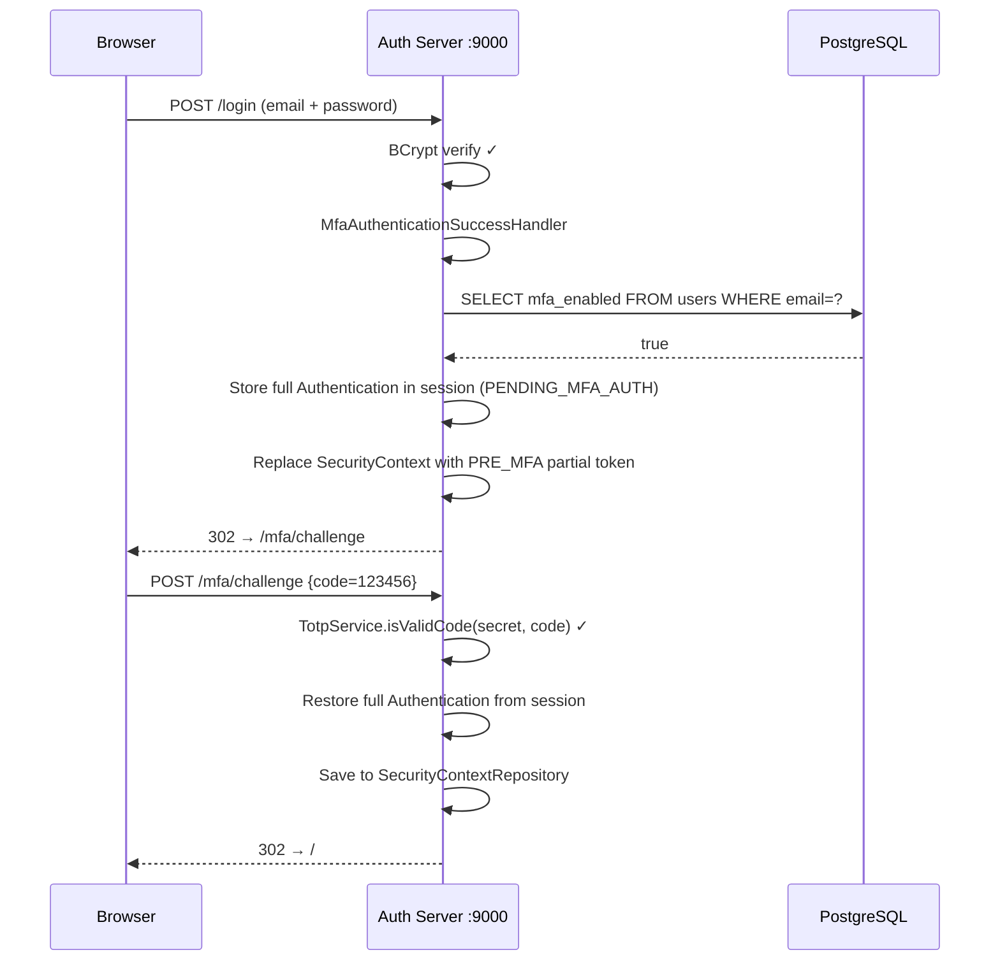

# Phase-09: TOTP MFA — Enrollment, Challenge, Recovery Codes

## What this PR does

Adds opt-in TOTP (Time-based One-Time Password) multi-factor authentication for LOCAL users. After enrolling, every subsequent password login is intercepted and held in a `PRE_MFA` partial-auth state until the user provides a valid 6-digit TOTP code or a one-time recovery code. FEDERATED users (Google, Okta, etc.) are unaffected — MFA is delegated to their upstream IDP.

---

## What changed

| Before | After |
|--------|-------|
| Password login → immediate session | Password login → `PRE_MFA` gate if MFA enrolled |
| No TOTP support | `TotpService` — secret generation, QR URI, code validation |
| `mfa_recovery_codes` table unused | `RecoveryCodeService` — 10 codes generated at enrollment |
| `/mfa/**` paths did not exist | Challenge, enroll, and recovery-codes pages |
| No new Flyway migration needed | All schema columns defined in PR-02 |

---

## MFA enrollment flow



---

## MFA login challenge flow



---

## PRE_MFA partial-auth pattern

Spring Security doesn't have a built-in two-factor flow. PR-09 implements it via a **partial authentication token**:

```
Password auth succeeds
        ↓
MfaAuthenticationSuccessHandler fires
        ↓
  mfa_enabled?
  ├── NO  → proceed normally (SimpleUrlAuthenticationSuccessHandler)
  └── YES → 1. Save full Authentication to session as PENDING_MFA_AUTH
             2. Replace SecurityContext with UsernamePasswordAuthenticationToken
                carrying only authority "PRE_MFA" (not ROLE_USER)
             3. Persist new context to HttpSession
             4. Redirect to /mfa/challenge
```

At `/mfa/challenge`:
- Spring Security requires `hasAuthority("PRE_MFA")` — anonymous users are redirected to `/login`
- On valid code: full `Authentication` is restored from session and saved back to `SecurityContextRepository`
- On invalid: stay on challenge page with `?error`

A user with `PRE_MFA` cannot access any other authenticated resource (no `ROLE_USER`) until they complete the challenge.

---

## Recovery codes

| Property | Value |
|----------|-------|
| Count per enrollment | 10 |
| Code format | 8 uppercase alphanumeric chars, excluding ambiguous chars (0/O, 1/I/L) |
| Storage | BCrypt hash in `mfa_recovery_codes.code_hash` |
| Plaintext | Shown once on `recovery-codes.html` (Flash attribute — cleared after first view) |
| After use | `used = true`, `used_at = now()` — never deleted (audit trail) |

Recovery codes are iterated on use: all `used=false` codes for the user are loaded and `BCrypt.matches()` is called on each until a match is found. With 10 codes max, this is ≤ 10 BCrypt operations (~1s worst case) — acceptable for a rare, security-critical path.

---

## `TotpService`

| Method | Behaviour |
|--------|-----------|
| `generateSecret()` | Returns a 32-char Base32 string via `DefaultSecretGenerator` |
| `generateOtpauthUri(secret, email)` | Builds `otpauth://totp/nthNode:email?secret=...&issuer=nthNode&...` |
| `isValidCode(secret, code)` | Validates with ±1 period (30s) tolerance via `DefaultCodeVerifier` |

The `otpauth://` URI is passed to the enroll page and rendered as a QR code client-side via `qrcodejs` (CDN). No server-side image generation — no ZXing dependency needed.

---

## FEDERATED users and MFA

`MfaAuthenticationSuccessHandler` fires only on form login (the `UsernamePasswordAuthenticationToken` path). OIDC logins complete through `oauth2Login()` which has its own success handler. FEDERATED users have `mfa_enabled = false` by default and are never directed to `/mfa/challenge`. Upstream IDP MFA (e.g. Google 2FA) is the responsibility of the IDP.

---

## Enrolling a user manually (local dev SQL)

```sql
-- Disable MFA (to re-test enrollment)
UPDATE users SET mfa_enabled = false, totp_secret_ref = null WHERE email = 'admin@localhost';
DELETE FROM mfa_recovery_codes WHERE user_id = (SELECT id FROM users WHERE email = 'admin@localhost');
```

---

## Schema used (no new migration)

All columns were defined in PR-02:

| Table / Column | Type | Purpose |
|----------------|------|---------|
| `users.mfa_enabled` | `boolean DEFAULT false` | Whether TOTP is active for this user |
| `users.totp_secret_ref` | `varchar` | Base32 secret (dev) or AWS Secrets Manager ARN (prod, PR-14) |
| `mfa_recovery_codes.code_hash` | `varchar(255)` | BCrypt hash of plaintext recovery code |
| `mfa_recovery_codes.used` | `boolean` | Consumed flag |
| `mfa_recovery_codes.used_at` | `timestamptz` | Timestamp of consumption |
